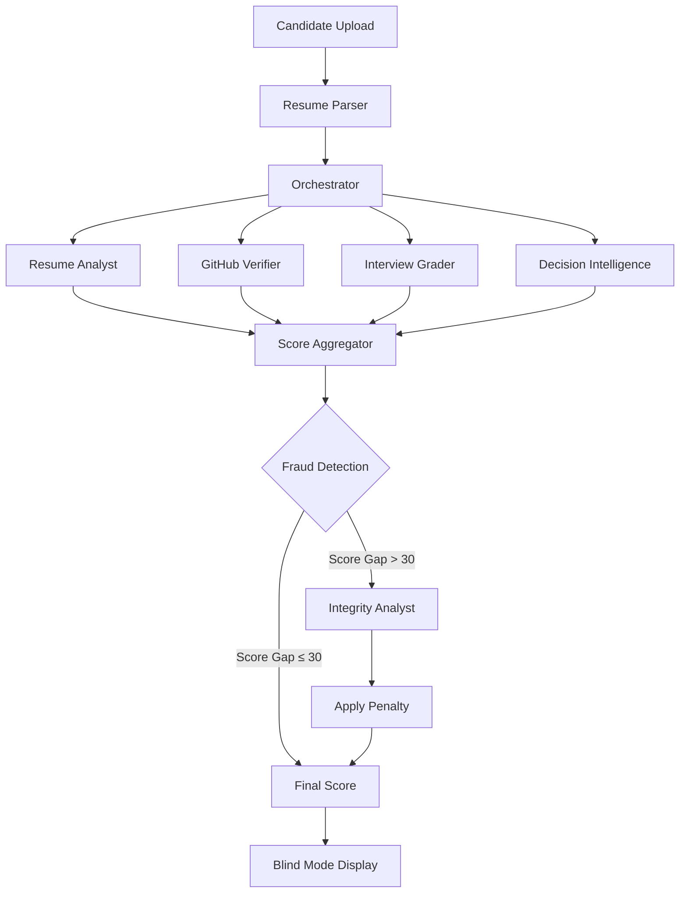

## The FairMatch evaluation process

FairMatch uses a sophisticated multi-agent AI system to evaluate candidates objectively. Each agent specializes in a specific evaluation dimension, and the orchestrator coordinates their work to produce a comprehensive assessment.

<Steps>
  <Step title="Candidate submission">
    Candidates upload their resume (PDF) and complete an optional AI interview questionnaire. Companies can also bulk import candidates from Excel/CSV files.
  </Step>
  
  <Step title="Data extraction">
    The Resume Analyst agent extracts structured data from the uploaded documents:
    - Name and contact information
    - Skills and technical expertise
    - Years of experience
    - Project descriptions
    
    ```python
    def get_resume_intelligence(resume_text: str) -> dict:
        # Query the Resume Analysis agent
        agents = orchestrator.search_agents_by_keyword("FairMatch Resume Analyst")
        msg = AgentMessage(content=resume_text, sender_id=orchestrator.agent_id)
        response = orchestrator.x402_processor.post(sync_url, json=msg.to_dict())
        return json.loads(response.json().get('response', '{}'))
    ```
  </Step>
  
  <Step title="Parallel agent evaluation">
    Five specialized agents evaluate the candidate simultaneously:
    
    **1. Resume Analyst** - Extracts and structures candidate data
    
    **2. GitHub Verifier** - Validates technical contributions and project quality
    
    **3. Interview Grader** - Assesses interview responses for depth and accuracy
    
    **4. Decision Intelligence** - Analyzes skill match, experience alignment, and consistency
    
    **5. Integrity Analyst** - Detects potential fraud or resume fabrication
  </Step>
  
  <Step title="Adaptive fraud detection">
    If GitHub and interview scores differ by more than 30 points, the system automatically spawns the Integrity Analyst:
    
    ```python
    if abs(github_score - interview_score) > 30 and candidate.github_link:
        print(f"FRAUD DETECTED: Spawning Integrity Agent...")
        fraud_query = f"GitHub Score: {github_score}\nInterview Score: {interview_score}"
        integrity_json = get_integrity_intelligence(fraud_query)
        integrity_penalty = integrity_json.get("penalty_score", 0)
    ```
  </Step>
  
  <Step title="Blind mode evaluation">
    During evaluation, all PII is masked. Evaluators see candidates as "Candidate ID-1234" instead of seeing names, emails, or demographic information.
  </Step>
  
  <Step title="Weighted scoring">
    The final score is calculated using company-defined weights:
    
    ```python
    final_score = (
        skill_score * (job.weight_skill / total_weight) +
        github_score * (job.weight_github / total_weight) +
        interview_score * (job.weight_interview / total_weight) +
        experience_score * (job.weight_experience / total_weight) +
        integrity_score * (job.weight_integrity / total_weight)
    )
    ```
  </Step>
</Steps>

## Agent orchestration architecture

FairMatch uses the Zynd AI agent framework to coordinate specialized agents. The orchestrator handles:

- Agent discovery via the Zynd registry
- Message routing between agents
- Payment processing for agent calls (x402 protocol)
- Response aggregation and error handling

```python
agent_config = AgentConfig(
    name="FairMatch Orchestrator",
    description="Orchestrates FairMatch AI evaluations",
    capabilities={"ai": ["orchestration"], "protocols": ["http"]},
    webhook_host="0.0.0.0",
    webhook_port=5000,
    registry_url="https://registry.zynd.ai"
)

orchestrator = ZyndAIAgent(agent_config=agent_config)
```

<Info>
  Each agent call is automatically paid for using the x402 payment protocol, enabling a decentralized marketplace of AI evaluation services.
</Info>

## Data flow diagram



## Evaluation result structure

Each candidate receives a comprehensive evaluation with multiple dimensions:

```python
class EvaluationResult:
    candidate_id: str
    job_id: str
    name: str
    skill_score: int        # 0-100: Skill match analysis
    github_score: int       # 0-100: Code quality and contributions
    interview_score: int    # 0-100: Interview response quality
    experience_score: int   # 0-100: Years of experience alignment
    integrity_score: int    # 0-100: Consistency and authenticity
    final_score: int        # Weighted average of all scores
    strengths: List[str]    # AI-identified candidate strengths
    weaknesses: List[str]   # AI-identified risk factors
    risk_level: str         # low, medium, high
    recommendation: str     # consider, interview, reject
```

<Note>
  All scores are calculated objectively by AI agents with no access to candidate demographics.
</Note>

## Company workflow

1. **Create a job listing** with required skills and experience
2. **Upload candidates** via CSV/Excel or accept individual applications
3. **Run evaluation** to trigger the multi-agent pipeline
4. **Toggle blind mode** to review candidates without bias
5. **Review rankings** in a secure dashboard with radar charts
6. **Make hiring decisions** based on objective scores

## Candidate workflow

1. **Register an account** on the FairMatch platform
2. **Browse open jobs** from companies using FairMatch
3. **Upload your resume** (PDF) to auto-fill your application
4. **Complete the AI interview** questionnaire (optional)
5. **Track your applications** in your candidate dashboard

<Warning>
  Candidates should ensure their GitHub profiles are public and up-to-date, as the GitHub Verifier agent will analyze commit history and project quality.
</Warning>